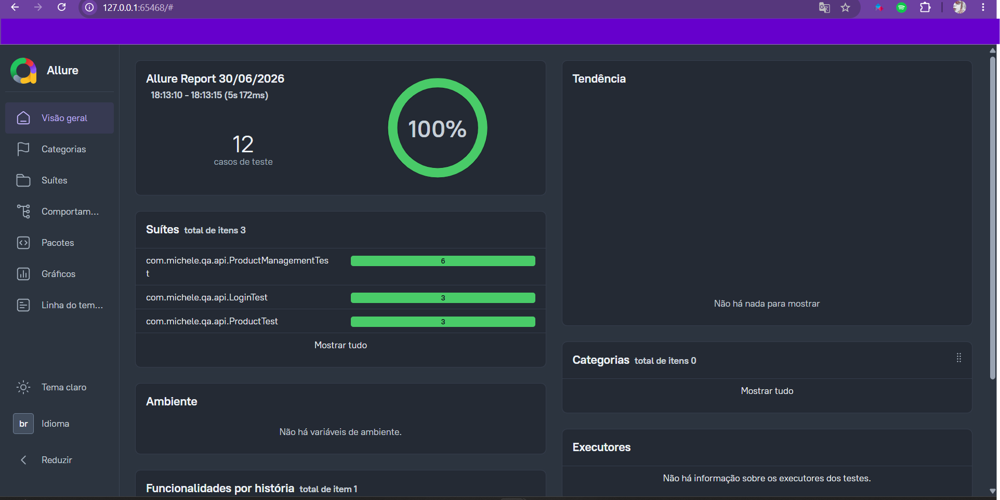

# 🚀 QA Automation Framework - OWASP Juice Shop

<p align="center">


</p>

---

# 📖 Sobre o Projeto

Framework de automação de testes desenvolvido para a aplicação **OWASP Juice Shop**, utilizando Java e aplicando boas práticas de arquitetura para testes de API.

O objetivo deste projeto é demonstrar conhecimentos em:

- Automação de testes de API
- Arquitetura de Frameworks de Teste
- Boas práticas de Clean Code
- Separação de responsabilidades
- Integração Contínua (CI)
- Relatórios automatizados

---

# 🎯 Objetivos

Este projeto foi desenvolvido para servir como portfólio profissional e demonstra conhecimentos em:

- RestAssured
- JUnit 5
- Maven
- Allure Report
- GitHub Actions
- JSON Schema Validation
- DTO Pattern
- Factory Pattern
- Service Layer
- Client Layer

---

# 🛠 Tecnologias Utilizadas

| Tecnologia | Finalidade |
|------------|------------|
| Java 17 | Linguagem principal |
| Maven | Gerenciamento de dependências |
| JUnit 5 | Framework de testes |
| RestAssured | Testes de API |
| Allure Report | Relatórios |
| JSON Schema Validator | Validação de contratos |
| DataFaker | Massa dinâmica |
| GitHub Actions | Integração Contínua |
| Docker | Execução da aplicação |

---

# 🏗 Arquitetura do Framework

```text
                    Test

                      │

                      ▼

                  Service

                      │

                      ▼

                   Client

                      │

                      ▼

              Request Specifications

                      │

                      ▼

                 REST API
```

Cada camada possui responsabilidade única:

- **API** → Casos de teste
- **Service** → Regras de negócio
- **Client** → Comunicação com API
- **RequestSpecs** → Configuração das requisições
- **Config** → Ambientes, Endpoints, Headers e Token

---

# 📂 Estrutura do Projeto

```text
qa-automation-juice-shop
│
├── .github
│   └── workflows
│       └── api-tests.yml
│
├── api-tests
│   └── juice-shop-api
│       │
│       ├── src
│       │
│       ├── test
│       │   ├── api
│       │   ├── base
│       │   ├── client
│       │   ├── config
│       │   ├── dto
│       │   ├── factory
│       │   ├── fixtures
│       │   ├── service
│       │   ├── specs
│       │   └── resources
│       │       ├── environments
│       │       └── schemas
│       │
│       └── pom.xml
│
├── docs
│
├── e2e-tests
│
├── performance-tests
│
└── README.md
```

---

# ✅ Funcionalidades Implementadas

## Login

- Login válido
- Login inválido
- Login com senha em branco

---

## Produtos

- Buscar produtos
- Buscar produto por ID
- Buscar produto inexistente

---

## Gerenciamento de Produtos

- Criar produto
- Criar produto autenticado
- Criar produto inválido
- Atualizar produto
- Excluir produto
- Método HTTP inválido

---

## Framework

- DTO Pattern
- Factory Pattern
- TokenManager
- Endpoints centralizados
- Constants
- Headers centralizados
- Environment Manager
- Request Specification
- JSON Schema Validation
- DataFaker

---

# 📋 Cobertura Atual

| Módulo | Status |
|---------|--------|
| Login | ✅ |
| Produtos | ✅ |
| Gerenciamento | ✅ |
| JSON Schema | ✅ |
| Allure | ✅ |
| GitHub Actions | ✅ |

---

# ▶ Como Executar

## 1 - Clonar o projeto

```bash
git clone https://github.com/michelejoohann/qa-automation-juice-shop.git
```

---

## 2 - Entrar na pasta

```bash
cd qa-automation-juice-shop/api-tests/juice-shop-api
```

---

## 3 - Executar a aplicação

```bash
docker run --rm -p 3000:3000 bkimminich/juice-shop
```

---

## 4 - Executar os testes

```bash
mvn clean test
```

---

## Executar por ambiente

```bash
mvn clean test -Denv=dev

mvn clean test -Denv=qa

mvn clean test -Denv=hml
```

---

# 📊 Allure Report



Após a execução dos testes:

```bash
allure serve target/allure-results
```

O relatório apresenta:

- Cenários executados
- Tempo de execução
- Evidências
- Status dos testes
- Histórico

---

# 🔄 Integração Contínua

O projeto possui pipeline utilizando **GitHub Actions**.

A cada:

- Push
- Pull Request

é executado automaticamente:

```bash
mvn clean test
```

---

# 📈 Roadmap

## API

- [x] Login
- [x] Produtos
- [x] CRUD Produtos
- [x] JSON Schema
- [x] TokenManager
- [x] DataFaker
- [ ] Basket
- [ ] Orders
- [ ] Address
- [ ] Reviews

---

## UI

- [ ] Playwright
- [ ] Page Objects
- [ ] Fixtures
- [ ] Allure

---

## Performance

- [ ] k6
- [ ] JMeter

---

## DevOps

- [ ] Docker Compose
- [ ] Jenkins
- [ ] SonarQube
- [ ] Publicação automática do Allure

---

# 👩‍💻 Autora

## Michèlé Joohann

QA Engineer | Software Quality | Test Automation

Especialista em:

- Automação de Testes
- APIs REST
- Qualidade de Software
- Processos de QA
- Testes Funcionais
- Testes Exploratórios

GitHub:

https://github.com/michelejoohann

---

# ⭐ Se este projeto foi útil

Considere deixar uma ⭐ no repositório.